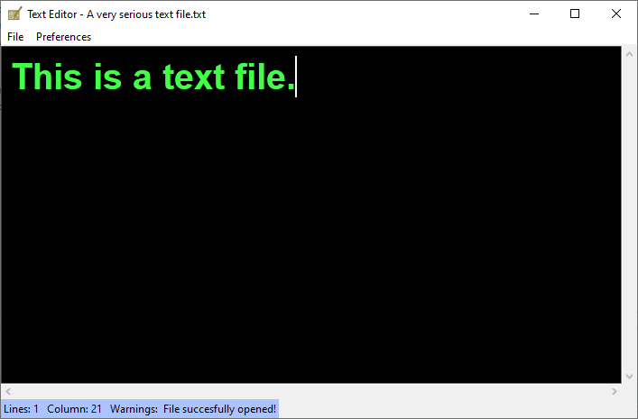

# Text Editor:pencil2:
#### **Overview**
This is a simple text editor written in Python3 using the tkinter module. For now it only works in Windows and it is possible to open,edit and save text files only.

#### **Features**
* Open,edit and save .txt files. :triumph:
* Change the way editor looks like! :scream:
  * Editor background color!
  * Text color!
  * Cursor color!
* Change fonts! :flushed:
  * Choose between Roboto,Arial Calibri,Impact,Verdana ...:sparkles:
  * Change to font size!
* Theres a status bar that displays some useless information about the file that  you are editing!:pray:
  
  
#### **Dependencies**
* [Python](https://www.python.org/download/releases/3.0/) 3.7.4 or later
* [tkinter](https://docs.python.org/3/library/tkinter.html)
* Developed and tested on Microsoft Windows 10 and hasn't been tested on other platforms.

#### **Installation**
1. **git clone https://github.com/alexandros98/text-editor.git**
2. Open **Command Prompt** and navigate to the **text-editor** folder.
3. Type **python main.py**

#### **Images**

